# Revue de conception — `/parc/bornes/[id]`

**Date** : 17 avril 2026
**Route** : `/parc/bornes/[id]` (page de détail d'une borne)
**Domaines analysés** : Design visuel · UX/Utilisabilité · Responsive · Accessibilité · Micro-interactions · Cohérence · Performance

## Résumé

La page est bien structurée et suit globalement les conventions shadcn/Tailwind v4 avec un système de tokens OKLCH cohérent. Cependant, plusieurs composants utilisent des éléments HTML bruts (`<input>`, `<select>`, `<checkbox>`) au lieu des primitives shadcn, brisant la cohérence du design system. Les problèmes les plus critiques sont : des données d'interventions statiques/hardcodées (non connectées à Supabase), du texte en anglais dans une interface en français, et l'absence totale de définition du thème sombre malgré la variante `dark:` configurée.

---

## Tableau des problèmes

| # | Problème | Criticité | Catégorie | Emplacement |
|---|----------|-----------|-----------|-------------|
| 1 | Le dernier élément du fil d'Ariane n'a pas `aria-current="page"` — non conforme WCAG 2.1 AA | 🔴 Critique | Accessibilité | `components/ui/breadcrumb.tsx:29-32` |
| 2 | La jauge SVG utilise des couleurs hardcodées (`#171717`, `white`) au lieu de variables CSS — ne fonctionnera pas en mode sombre | 🔴 Critique | Design visuel | `features/parc/components/paper-usage-section.tsx:22-29` |
| 3 | Les données des interventions sont **statiques** (tableau `ITEMS` hardcodé) — aucune connexion à Supabase, aucune prop `borneId` | 🔴 Critique | Performance / UX | `features/parc/components/interventions-section.tsx:23-51` |
| 4 | Texte en anglais dans une interface française : *"Delete borne"*, *"Are you absolutely sure?"*, *"Cancel"*, *"Continue"* | 🔴 Critique | Cohérence | `features/parc/components/danger-zone-section.tsx:52, 65, 73, 78` |
| 5 | `<input>` HTML brut au lieu du composant shadcn `Input` — perd les états ARIA, focus et cohérence visuelle | 🟠 Élevé | Cohérence / Accessibilité | `features/parc/components/borne-profile.tsx:133-135, 143-145, 151-153` |
| 6 | `<input type="checkbox">` HTML brut au lieu du composant shadcn `Checkbox` | 🟠 Élevé | Cohérence / Accessibilité | `features/parc/components/horaires-section.tsx:98-104` |
| 7 | `<select>` HTML brut au lieu du composant shadcn `Select` | 🟠 Élevé | Cohérence / Accessibilité | `features/parc/components/paper-usage-section.tsx:228-234` |
| 8 | Grille CSS avec colonnes fixes en pixels (`grid-cols-[140px_1fr_1fr_80px]`) — cassée sur mobile | 🟠 Élevé | Responsive | `features/parc/components/horaires-section.tsx:69-74` |
| 9 | Panneau droit fixe `w-[250px] shrink-0` dans la carte papier — zone graphique trop étroite sur petit écran | 🟠 Élevé | Responsive | `features/parc/components/paper-usage-section.tsx:227` |
| 10 | Graphique à barres codé de zéro alors que Recharts est installé — pas d'accessibilité, de tooltips ni d'animation | 🟠 Élevé | Performance / Cohérence | `features/parc/components/paper-usage-section.tsx:130-170` |
| 11 | Faute de frappe : `"Aujourdhui"` au lieu de `"Aujourd'hui"` | 🟠 Élevé | Design visuel | `features/parc/components/paper-usage-section.tsx:241` |
| 12 | Aucun bloc de thème sombre défini dans `globals.css` — la variante `dark:` configurée ne fonctionne donc pas | 🟠 Élevé | Design visuel | `app/globals.css` |
| 13 | Les boutons *Enregistrer* / *Annuler* flottent à droite sans association visuelle claire avec le formulaire | 🟡 Moyen | UX | `features/parc/components/borne-profile.tsx:157-185` |
| 14 | Le bouton de suppression a un style secondaire neutre — ne communique pas visuellement le danger | 🟡 Moyen | Design visuel | `features/parc/components/danger-zone-section.tsx:49-55` |
| 15 | `items-center` sur les lignes de la timeline provoque un mauvais alignement quand les cartes ont des hauteurs différentes | 🟡 Moyen | Design visuel | `features/parc/components/interventions-section.tsx:107` |
| 16 | Le bouton `⋮` (`EllipsisVertical`) n'a aucun menu ni action associé — bouton non fonctionnel, trompeur | 🟡 Moyen | UX | `features/parc/components/paper-usage-section.tsx:217-219` |
| 17 | Section *Mises à jour* : affiche l'état mais n'a pas de bouton pour déclencher une mise à jour | 🟡 Moyen | UX | `features/parc/components/updates-section.tsx:37-39` |
| 18 | Dates relatives en anglais avec fautes grammaticales : `"2 month's ago"` → `"il y a 2 mois"`, etc. | 🟡 Moyen | Cohérence | `features/parc/components/interventions-section.tsx:27, 34, 39` |
| 19 | Pas de `gap` ni de `pb` sur le wrapper de page — chaque section gère son propre `pt-12`, difficile à maintenir | 🟡 Moyen | Cohérence | `app/(dashboard)/parc/bornes/[id]/page.tsx:32` |
| 20 | `TimelineDateRight` et `TimelineDateLeft` : deux composants séparés à logique identique — à fusionner | ⚪ Bas | Cohérence | `features/parc/components/interventions-section.tsx:82-96` |
| 21 | `avatarUrl` hardcodée vers une URL CDN Figma dans le footer de la sidebar — fragile et non pérenne | ⚪ Bas | Cohérence | `components/layout/sidebar/sidebar.tsx:24` |
| 22 | Dernier élément du fil d'Ariane sans style visuel distinct par rapport aux autres liens | ⚪ Bas | Design visuel | `components/ui/breadcrumb.tsx:29-32` |

---

## Légende

| Symbole | Niveau | Description |
|---------|--------|-------------|
| 🔴 | **Critique** | Casse une fonctionnalité ou viole les standards d'accessibilité |
| 🟠 | **Élevé** | Impact significatif sur l'expérience utilisateur ou la qualité du design |
| 🟡 | **Moyen** | Problème notable à corriger |
| ⚪ | **Bas** | Amélioration optionnelle |

---

## Plan d'action recommandé

```mermaid
graph TD
    A[🔴 Critique — À faire immédiatement] --> A1[Connecter InterventionsSection à Supabase]
    A --> A2[Traduire tous les textes anglais en français]
    A --> A3[Ajouter aria-current=page sur le fil d'Ariane]
    A --> A4[Corriger les couleurs SVG hardcodées de la jauge]

    B[🟠 Élevé — Court terme] --> B1[Remplacer input / select / checkbox bruts par composants shadcn]
    B --> B2[Rendre HorairesSection et PaperUsageSection responsive]
    B --> B3[Migrer BarChart maison vers Recharts + ChartContainer]
    B --> B4[Corriger la faute de frappe Aujourdhui]
    B --> B5[Définir le thème sombre dans globals.css]

    C[🟡 Moyen — Moyen terme] --> C1[Encapsuler les boutons dans un pied de formulaire sticky]
    C --> C2[Rendre le bouton Supprimer visuellement destructif]
    C --> C3[Corriger l'alignement items-start sur la timeline]
    C --> C4[Ajouter un bouton Mettre à jour dans UpdatesSection]
    C --> C5[Supprimer ou connecter le bouton EllipsisVertical]
```

